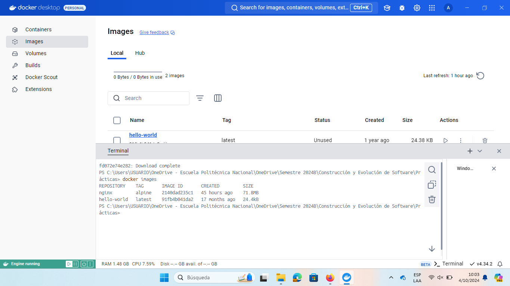

# Imagen
Es un archivo único que contiene todos los programas, librerías, dependencias y configuraciones necesarias para instalar y/o ejecutar una aplicación o un conjunto de aplicaciones.


## ¿Cuál es la relación entre una imagen y un contenedor? 
La imagen contiene todo lo necesario (programas, dependencias librerías) para que el contenedor pueda ejecutarse.
Al crear un contenedor se debe especificar la imagen que se desea.


## Comandos para imágenes

### Descargar imagen
Descarga la última versión de la imagen disponible en el registro de Docker.

```
docker pull <nombre imagen> 
```

Descarga una versión específica de la imagen, cada imagen tiene etiquetas (tags) para diferentes versiones.
Una imagen puede tener la etiqueta latest para representar la última versión, si no se especifica una etiqueta se hará referencia a la versión latest.

```
docker pull <nombre imagen>:<tag>
```

Descargar la imagen **hello-world**
### Comando: 
```
docker pull hello-world
```
### Ejecución:
```
Using default tag: latest
latest: Pulling from library/hello-world
c1ec31eb5944: Download complete
Digest: sha256:91fb4b041da273d5a3273b6d587d62d518300a6ad268b28628f74997b93171b2
Status: Downloaded newer image for hello-world:latest
docker.io/library/hello-world:latest
What's next:
    View a summary of image vulnerabilities and recommendations → docker scout quickview hello-world
```

**¿Qué es nginx**
#### Es un software de servidor web diseñado para manejar solicitudes HTTP y HTTPS.

Descargar la imagen  **nginx** en la versión **alpine**
### Comando:
```
docker pull nginx:alpine
```
### Ejecución:

```
alpine: Pulling from library/nginx
d1171b13e412: Download complete
f99ac9ba1313: Download complete
fd072e74e282: Download complete
45eb579d59b2: Download complete
379754eea6a7: Download complete
43c4264eed91: Download complete
596d53a7de88: Download complete
472934715761: Download complete
Digest: sha256:2140dad235c130ac861018a4e13a6bc8aea3a35f3a40e20c1b060d51a7efd250
Status: Downloaded newer image for nginx:alpine
docker.io/library/nginx:alpine

What's next:
    View a summary of image vulnerabilities and recommendations → docker scout quickview nginx:alpine
```

### Listar imágenes

```
docker images
```



**Identificadores**

En Docker, se utilizan varios identificadores para diferenciar de manera única los elementos del sistema, como imágenes, contenedores, volúmenes y redes. Estos identificadores son generados automáticamente por Docker y son únicos dentro del contexto del sistema Docker en el que se encuentran. 

### Inspeccionar una imagen
El comando docker inspect se utiliza para obtener información detallada sobre un objeto de Docker específico, como un contenedor, una imagen, un volumen o una red.  Proporciona información en formato JSON sobre el objeto especificado.

```
docker inspect <nombre imagen>
docker inspect <nombre imagen>:<tag>
```

Inspeccionar la imagen hello-world 

### Comando:

```
docker inspect hello-world
```

### Ejecución:

```
[
    {
        "Id": "sha256:91fb4b041da273d5a3273b6d587d62d518300a6ad268b28628f74997b93171b2",
        "RepoTags": [
            "hello-world:latest"
        ],
        "RepoDigests": [
            "hello-world@sha256:91fb4b041da273d5a3273b6d587d62d518300a6ad268b28628f74997b93171b2"
        ],
        "Parent": "",
        "Comment": "buildkit.dockerfile.v0",
        "Created": "2023-05-02T16:49:27Z",
        "DockerVersion": "27.2.0",
        "Author": "",
        "Config": {
            "Hostname": "",
            "Domainname": "",
            "User": "",
            "AttachStdin": false,
            "AttachStdout": false,
            "AttachStderr": false,
            "Tty": false,
            "OpenStdin": false,
            "StdinOnce": false,
            "Env": [
                "PATH=/usr/local/sbin:/usr/local/bin:/usr/sbin:/usr/bin:/sbin:/bin"
            ],
            "Cmd": [
                "/hello"
            ],
            "ArgsEscaped": true,
            "Image": "",
            "Volumes": null,
            "WorkingDir": "/",
            "Entrypoint": null,
            "OnBuild": null,
            "Labels": null
        },
        "Architecture": "amd64",
        "Os": "linux",
        "Size": 15288,
        "GraphDriver": {
            "Data": null,
            "Name": "overlayfs"
        },
        "RootFS": {
            "Type": "layers",
            "Layers": [
                "sha256:ac28800ec8bb38d5c35b49d45a6ac4777544941199075dff8c4eb63e093aa81e"
            ]
        },
        "Metadata": {
            "LastTagTime": "2024-10-04T14:56:45.154189574Z"
        }
    }
]
```

**¿Con qué algoritmo se está generando el ID de la imagen**

#### El ID de una imagen de Docker se genera utilizando un algoritmo criptográfico de hashing SHA-256. 

### Filtrar imágenes

```
docker images | grep <termino a buscar>

```

### Para eliminar una imagen
Eliminar permanentemente la imagen de tu sistema Docker.

```
docker rmi <nombre imagen>:<tag>
```

Eliminar la imagen hello-world 

### Comando:

```
docker rmi hello-world:latest
```

### Ejecución:

```
Untagged: hello-world:latest
Deleted: sha256:91fb4b041da273d5a3273b6d587d62d518300a6ad268b28628f74997b93171b2
```

-f: Es la opción para forzar la eliminación de la imagen incluso si hay contenedores en ejecución que utilizan esa imagen.
Cuando eliminas una imagen Docker, Docker no elimina automáticamente los contenedores que se han creado a partir de esa imagen. Esto significa que, aunque hayas eliminado la imagen, el contenedor seguirá ejecutándose normalmente.  
**Considerar**
Eliminar una imagen no afecta a los contenedores que se han creado a partir de esa imagen, a menos que esos contenedores dependan de archivos o configuraciones específicas de la imagen eliminada. En ese caso, es posible que los contenedores se comporten de manera inesperada después de eliminar la imagen.
Es una buena práctica detener y eliminar todos los contenedores que dependan de una imagen antes de eliminar la imagen en sí.

```
docker rmi -f <nombre imagen>:<tag>
```

