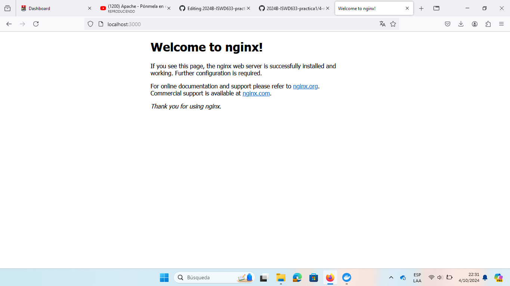
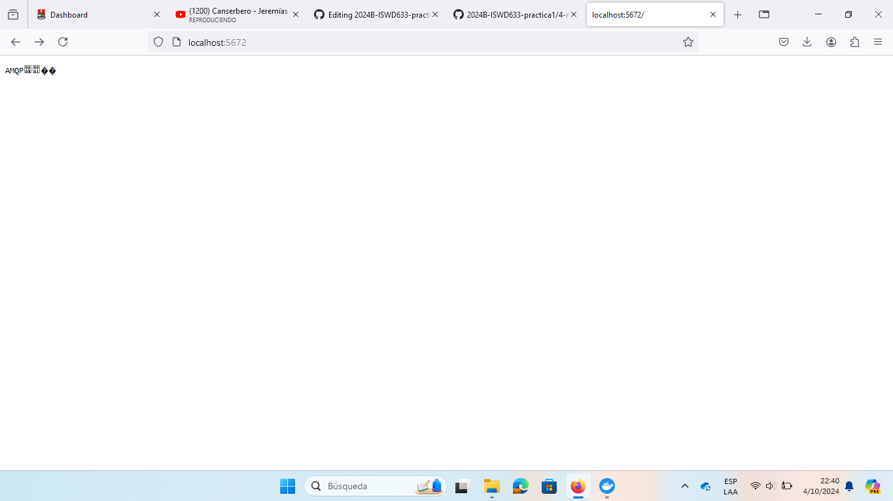
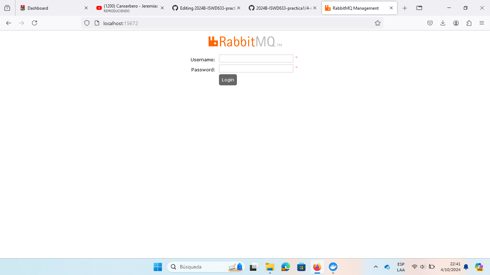

# Mapeo de puertos
El mapeo de puertos es un mecanismo que permite redirigir el tráfico de red desde un puerto en el host (tu máquina local o servidor) hacia un puerto específico en un contenedor Docker.
Por ejemplo, supongamos que tienes un contenedor que ejecuta un servidor web en el puerto 80 dentro del contenedor, pero quieres acceder a ese servidor desde tu navegador en la máquina host. Puedes usar el mapeo de puertos para redirigir el tráfico del puerto 80 del contenedor al puerto 3000 en el host. De esta manera, cuando accedas a http://localhost:3000 en tu navegador, el tráfico se dirigirá al servidor web dentro del contenedor en el puerto 80.


### Para crear un mapeo de puertos (puerto host y puerto contenedor)
El mapeo de puertos se especifica al ejecutar un contenedor Docker utilizando la opción -p o --publish seguida de los puertos que deseas mapear
```
docker run -d --name <nombre contenedor> -p <puerto host>:<puerto contenedor> <nombre imagen>:<tag>

```
### Actividad 1: Crear un contenedor a partir de la imagen nginx version alpine con el mapeo de puertos del ejemplo gráfico, host 3000 y contenedor 80

### Comando:

```
docker run -d --name srv-web3 -p 3000:80 nginx:alpine
```

### Salida:

```
58c0a6d1fbd05e88e5ab9c0f3ef309b70fb677a17c01c815d54a9a96585e7774
```

### Actividad 2: COLOCAR UNA CAPTURA DE PANTALLA  DEL ACCESO http://localhost:3000




### Para mapear más de un puerto

```
docker run -d --name <nombre contenedor> -p <puerto host 01>:<puerto contenedor 01> -p <puerto host 02>:<puerto contenedor 02> <nombre imagen>:<tag>
```

### Actividad 3: Crear un contenedor a partir de la imagen rabbitmq version management-alpine, para este mapeo de puertos usar en el host los mismos puertos del contenedor.

### Comando:

```
docker run -d --name srv-msj -p 5672:5672 -p 15672:15672 rabbitmq:management-alpine
```

### Salida:

```
Unable to find image 'rabbitmq:management-alpine' locally
management-alpine: Pulling from library/rabbitmq
c73dafd1e64a: Download complete
4e32b392fd8a: Download complete
d92616363640: Download complete
3a05a17184ae: Download complete
3a09dd5992a6: Download complete
a1fdeb8f117b: Download complete
e0b19c2ef934: Download complete
cb932313f0f1: Download complete
bf375c7e8f45: Download complete
Digest: sha256:f880f33ee2cc0930f595abcf03f5558d08287cbc513b3987fceb418e213449bc
Status: Downloaded newer image for rabbitmq:management-alpine
6c95ab7a4f642114d30fce8499ec90008090f77252f14c8afb97c2a258a59d64
```

### Captura de pantalla del acceso http://localhost:5672



### Captura de pantalla del acceso http://localhost:15672



